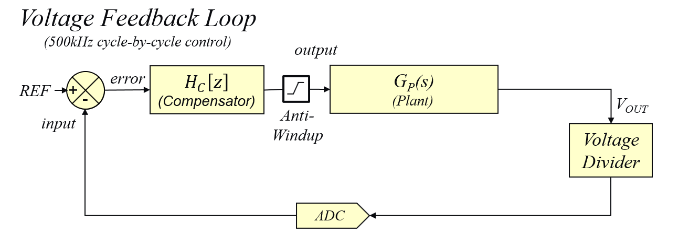
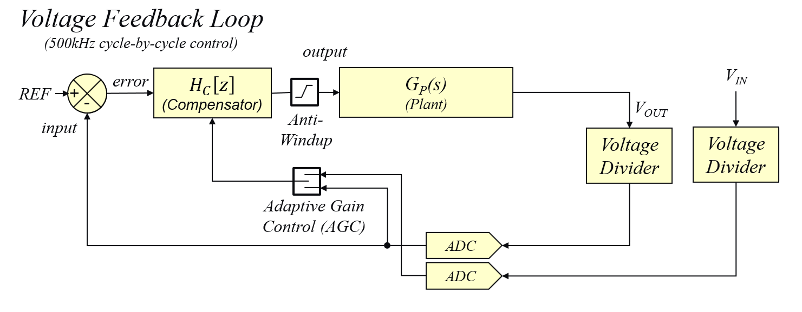
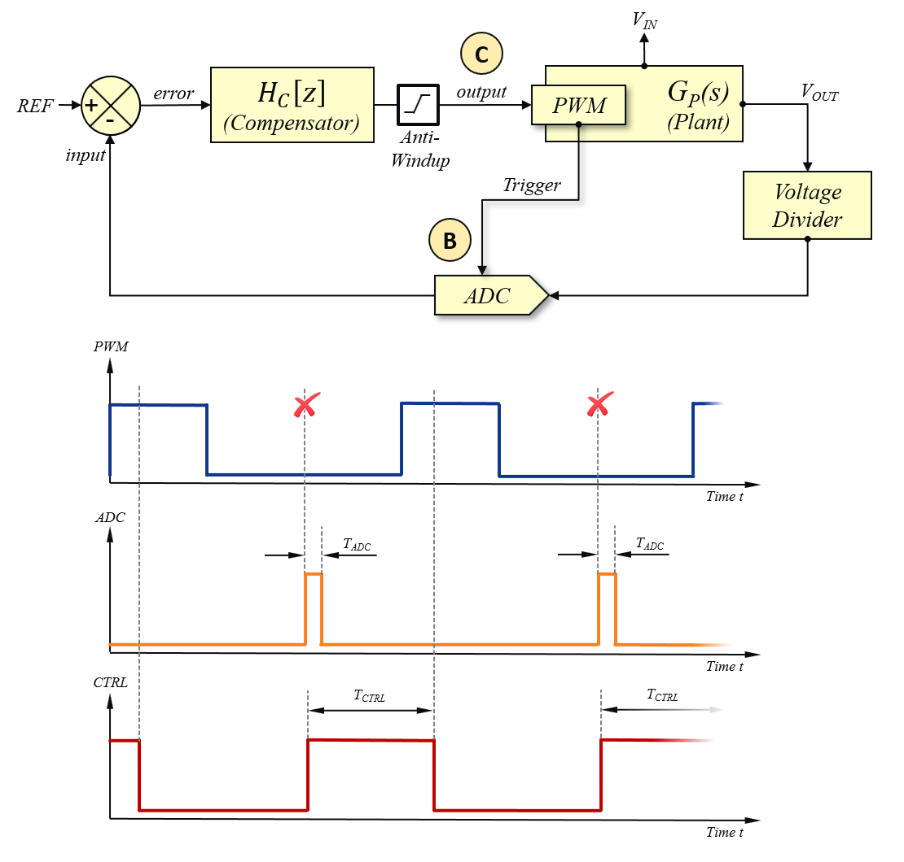
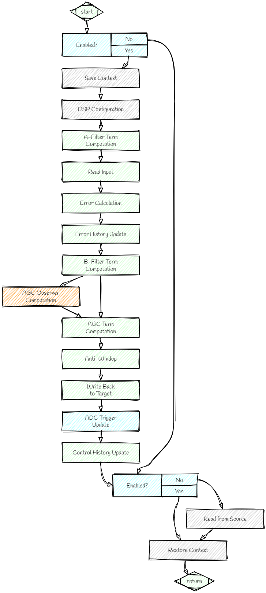
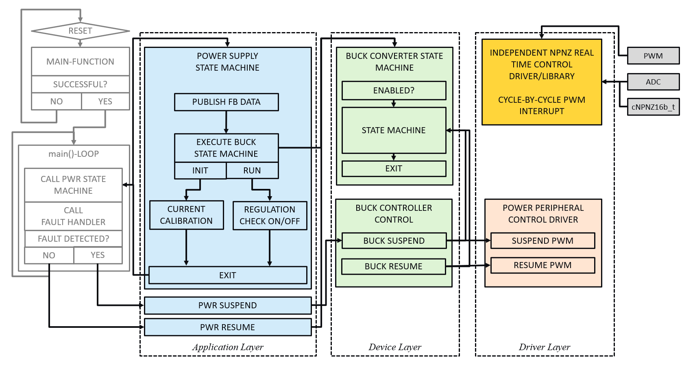

# Power Supply Control

  <!-- start tag for internal references -->

    

## Table of Contents

- [DPSK3 Buck Converter Adaptive Gain Control Implementation](#vmc_1)
- [Control Loop Block Diagram](#vmc_2)
- [Control Loop Timing](#vmc_3)
- [Control Loop Flow Chart](#vmc_4)
- [Control Loop Firmware Implementation](#vmc_5)

 

## 1) DPSK3 Buck Converter Adaptive Gain Control Implementation

This firmware demonstrates the implementation of a simple, single loop voltage mode controller used to regulate the constant output voltage of the on-board  step-down converter of the Digital Power Starter Kit 3 (DPSK3). The implementation of the Voltage Feedback Loop requires one Analog-to-Digital Converter (ADC) input oversampling the output voltage of the converter and two PWM outputs (PWM high and PWM low) to drive the power converter half-bridge switch node in synchronous mode. 

[[back](#startDoc)]
 

## 2) Control Loop Block Diagram

*Figure 1* shows the block diagram of the buck converter voltage mode controller, where the ADC input is used to sample the most recent level of the output voltage feedback signal. Once converted, the value is then compared against the internal reference value and the inverse of the deviation between reference and feedback (= *error*) is pushed through the discrete compensation filter. 

In the Anti-Windup block, the output of the compensation filter is checked against user-specified minimum and maximum thresholds. Should any of these thresholds be exceeded, the controller output will be overwritten with the respective threshold value before being written directly to the PWM duty cycle register of the PWM logic.

    
     <i>Figure 1: Control Loop Block Diagram of basic Voltage Mode Control Loop</i> 

 

*Figure 2* shows the block diagram of the enhanced buck converter voltage mode controller incorporating the adaptive gain control observer. This observer opens an additional input port for the most recent input voltage into the control system. In every control cycle, the AGC observer measures the most recent voltage applied across the main inductor. Plant gain variations caused by variations of the voltage across the inductor are compensated by adjusting the loop gain to a normalized gain level. The normalized gain level is set by the user by defining the nominal (most likely) operating conditions (e.g. VIN = 9 V, VOUT = 3.3 V for DPSK3). The reciprocal of the ratio between the nominal open loop gain and the most recent open loop gain is multiplied with the error term of the IIR-based compensation filter. As a result, dropping plant gain will be countered with an increased loop gain and increased plant gain will be countered with reduced loop gain to continuously maintain a stable open loop gain of the closed loop system with identical cross-over frequency, phase- and gain-margin.

    
     <i>Figure 2: Control Loop Block Diagram with Adaptive Gain Control Observer</i> 

 

#### Adaptive Gain Control Theory

The compensation filter is based on an Infinite-Impulse-Response (IIR) filter computation, which breaks into two elements:
* A-Term: multiplying the most recent control loop output delay line elements with one set of coefficients (post-filter)
* B-Term: multiplying the most error input delay line elements with a second set of coefficients (pre-filter)

While the A-term computation is responsible for the integration of the control loop output, the B-term computation is determining the effective loop gain by amplifying the incoming signal transient. By multiplying the computation result of the B-term, the modulation of the transient amplitude effectively results in a direct modulation of the total feedback loop gain. 

In voltage mode control, the open loop gain of the closed loop system mainly depends on the most recent DC-gain of the plant. This DC-gain is solely determined by the input voltage. As digital controllers operating in a normalized number range, the equation for calculating the DC-gain of the plant is 
$$
G=20 * log(VIN)
\tag{1}
$$

Therefore, conventional feed-forward implementations in analog are compensating for variations in input voltage only. However, even if conventional feed-forward control is a very efficient way to stabilize the open loop gain response time, in a buck converter it still shows variations over changes in output voltage, because the effective open loop gain of the closed loop system indeed depends on the voltage across the inductor VL given by 
$$
{\frac {V_L} L} = {\frac {(V_{IN} - V_{OUT})} L} = {\frac {dI} {dt} }
\tag{2}
$$
As shown in Equation (2), the slew rate of the inductor current changes with the voltage applied across it. A steeper slew rate allows to store more energy in a given period of time, resulting in higher open loop gain, while a lower slew rate results in less energy within the same time period (= less gain). Hence, to modulate the feedback loop gain, we replace the current slew rate by the constant kL:
$$
{\frac {dI} {dt} } = k_{L}
\tag{3}
$$
By dividing the previously determined slew rate factor under nominal operating conditions kL_nominal by the most recent slew rate factor kL_inst, we get derive the normalization factor kagb:
$$
k_{agc} = {\frac {V_{L_{nominal}}} {V_{L_{inst}}}}
\tag{4}
$$
By substituting VL_nominal and VL_inst with their respective voltage ratios from equation (2), we can eliminate the inductance L from the equation and end up with the hardware agnostic computation, only relying on voltage ratios, which can be measured and calculated during runtime:
$$
k_{agc} = {\frac {{V_{IN_{nominal}}} - {V_{OUT_{nominal}}}} {{V_{IN_{inst}}} - {V_{OUT_{inst}}}} }
\tag {5}
$$
where 
VIN_nominal = 9V
VOUT_nominal = 3.3V
VIN_nominal = most recent input voltage
VOUT_nominal = most recent output voltage

The Adaptive Gain Control Observer computation is called directly from within the assembly feedback loop code after the B-term result of the IIR filter computation has been calculated. Adaptive Gain Control Observer computation module reads the most recent input and output voltage samples and calculates the most recent value of kagc. This most recent kagc factor is then multiplied with the most recent B-term result, which then gets added to the  result of the A-term computation of the filter, eventually producing the final controller output, which gets written to the PWM duty cycle register.

#### Adaptive Gain Control Implementation

[PowerSmart&trade; Digital Control Loop Designer (PS-DCLD)](https://areiter128.github.io/DCLD) is used to enable the internal function hook between the A- and B-terms of the filter computation, which will call the AGC Observer. The AGC Observer code itself, however, is an independent code module accessing the same NPNZ16b data structure as the main feedback loop to derive the input and output voltage feedback scaling and source register information required for the AGC factor calculation. The result of the AGC factor calculation is then placed in the NPNZ16b data structure for the main loop to pick up and modulate the B-term result.

By breaking out the AGC observer calculation, hardware dependencies can be considered as this calculation will be different for most topologies and also depends on feedback types and gains. For example, the input and output voltage dividers of the buck converter on DPSK3 have been designed to provide feedback gains which are multiple integers of the other (GVOUT = 4 x GVIN). This allows a very fast and straight forward input voltage vs. output voltage normalization by simply shifting the most recent sample of VIN two bits to the left instead of scaling each sample with its respective gain. This approach helps to save CPU load and shorten computation time for a high-speed cycle-by-cycle control implementation.

[[back](#startDoc)]
  

## 3) Control Loop Timing

The single voltage loop controller is triggered by the PWM counter at the same time as the ADC is triggered. The control loop is executing the overhead code of calculating the first part of the compensation filter term (= *A-Term*) until the most recent ADC sample is available to be processed in the later part of the compensation filter term computation (= *B-Term*). This approach helps to shorten the overall response time of the controller measured between ADC trigger and write back event of the most recent controller result to the duty cycle register of the PWM generator. The new controller output value will then be divided by two and added to half of the period value to place the new ADC trigger point at 50% of the off-time. If the user has specified an additional offset to compensate FET driver propagation delays, this constant time-offset is also added before the ADC trigger location is updated. The the new duty cycle value will be updated immediately when the new value of the ADC trigger location is written to the PWM generator logic. By placing the ADC trigger point at 50% of the off time, the total control response is less than half a switching period, resulting in minimized phase erosion. 

    
     <i>Figure 3: Control Loop Timing</i> 

 

[[back](#startDoc)]
 

## 4) Control Loop Flow Chart

*Figure 4* shows a typical flow chart of a discrete software feedback loop called at the desired control frequency. It covers the loop path from ADC trigger to PWM output shown in the block diagram above (see *Figure 2 and 3*) while supporting additional features like an *Enable/Disable Bypass Switch* or advanced features like *Adaptive Gain Control (AGC)*.

-  <b>[green]</b> boxes represent default building blocks
-  <b>[grey]</b>  boxes represent unused optional features 
-  <b>[blue]</b>  boxes represent active optional features 

    
     <i>Figure 4: Control Loop Flow Chart</i> 

 

[[back](#startDoc)]
 

## 5) Control Loop Firmware Implementation

*Figure 5* shows a typical implementation of the power converter state machine and the high-speed control loop in a task scheduler based firmware environment.

-  <b>Real Time Control Loop and Low Level Drivers</b> 
The control loop is called in an independent high priority Interrupt Service Routine (ISR) by the PWM module simultaneously with triggering the ADC input. Thus, the control loop is tightly coupled to the PWM switching signal and synchronized to the most recent ADC conversion process, allowing a highly deterministic arrangement of code execution, peripheral module activity and external analog circuit operation. The interrupt priority needs to be high enough to override all other software tasks of the firmware to ensure jitter-free execution of the control loop. 
  
-  <b>Topology-Specific State Machine Library</b>
Each converter topology requires a specifically tailored configuration of related chip resources as well as start-up, control and monitoring procedures. *Topology State Machine Libraries* support a wide range of circuit configurations, control modes and functional features. Build-in peripheral configuration drivers are used to ease the configuration of required chip resources, such as number of PWM channels and their signal configuration, number of Analog-to-Digital (ADC) inputs, analog comparators, Digital-to-Analog Converter (DAC) channels, etc. 
All user configurations of a topology specific power converter are encapsulated in a comprehensive data object. This approach allows the definition of multiple power supplies of the same type being included, monitored and run independently from each other. Each of these power converter objects also include the declaration of the high-speed control loop object described above, enabling it to control peripherals and control loop code to be synchronized to time-critical states.
  
-  <b>Application Layer of the Power Supply Control Task</b> 
The application layer of this task is the proprietary firmware component covering the application-specific configuration of library data objects and high-speed control loops. It also allows to add and tailor functions, which are not covered by the default features of library modules.
  
-  <b>Scheduler Level</b> 
The scheduler level organizes all tasks of the firmware. Besides the power control and related fault handler task, this DPSK3 code example includes the on-board LC display data output, the on-board push-button control of the LC display screens and the on-board debugging LED, which are considered  less time critical, low-priority tasks. The main task scheduler in this firmware example therefore supports two priority levels, one for power control and fault handling, executed at a rate of 10 kHz (= 100 us interval) and the low priority tasks, executed at rates between 0.5 ms and 250 ms. 
  

    
     <i>Figure 5: Control Loop Firmware Implementation</i> 

    
More detailed information on the library implementation, such as task and library APIs, can be found in the chapter *Software Overview* on the left side of this window.

[[back](#startDoc)]

_________________________________________________
(c) 2021, Microchip Technology Inc.
